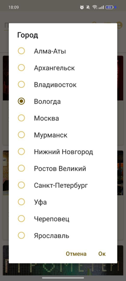

# Мобильное приложение для бронирования

## Описание

Приложение представляет из сервис, с помощью которого клиенты могут найти заведение и забронировать место в нём.

* Пользователи могут искать интересующие их заведения по названию, а также фильтровать по городам.

* Пользователи могут выбрать дату и забронировать интересующие их места на нужное время.

* Также есть возможность посмотреть историю бронирований.

  
  
  

  
  

 

## Используемые технологии

Приложение разработано под ОС Android на языке Kotlin с применением паттерна MVVM. Стек:
* Hilt
* Coroutines
* Room
* Retrofit
* Coil
